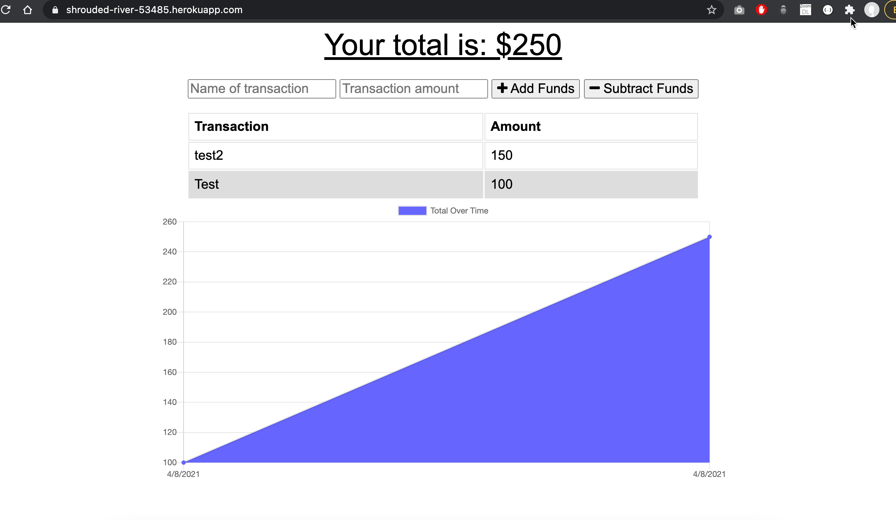
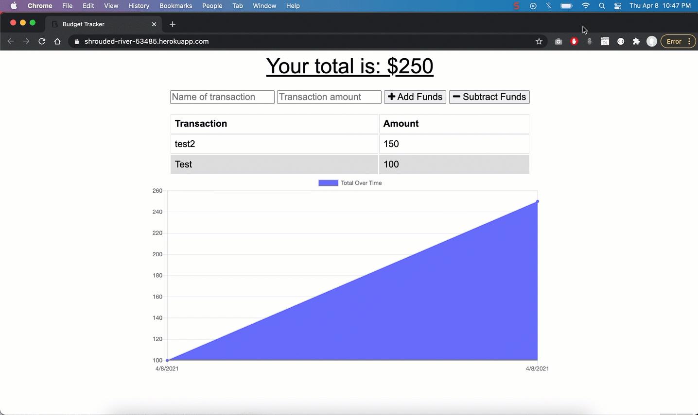

# progressive-budget
## Description 
   

Using progressive budget app, users will be able to add expenses and deposits to their budget with or without a connection. When entering transactions offline, they should populate the total when brought back online.

Offline Functionality:

* Enter deposits offline

* Enter expenses offline

When brought back online:

* Offline entries should be added to tracker.


 

## Heroku Deploymet:
This app is also deployed in heroku. Please click this link to view the  [Deployed App](https://shrouded-river-53485.herokuapp.com/) in heroku.

  ## Table of Contents
  * [Technologies Used](#technologies)
  * [Installation](#installation)
  * [Usage](#usage)
  * [Contributing](#contributing)
  * [Tests](#tests)
  * [License](#license)
  
  ## Technologies
 HTML, CSS, JavaScript, Node, Express, Mongo, Mongoose
  
  ## Installation
    
Clone the repository to your local development environment.

```
git clone https://github.com/binayaluitel2/progressive-budget
```
To start the server, run ```npm start```. To access the app after starting the server, go to http://localhost:3004 in your browser.

  ## Usage 
    
  
  
  ## Contributing
  
  Binaya Luitel
  
  ## Tests  
  
 None
  
  ## License
  
  MIT License
  
